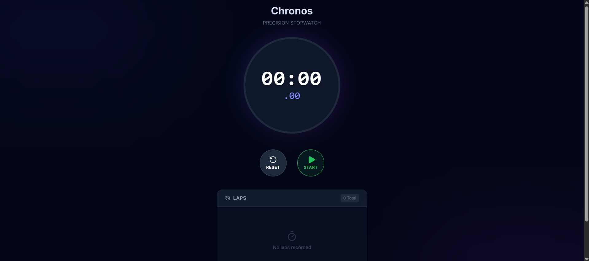

# Chronos Stopwatch



> **Note:** A high-precision stopwatch application featuring a modern dark-themed interface and lap tracking.

## 🚀 Overview

**Chronos** is a sleek, responsive stopwatch web application. It moves beyond simple `setInterval` implementations by using `requestAnimationFrame` for high-precision timing, ensuring accurate millisecond tracking without drift. The UI is built with a "Glassmorphism" aesthetic in dark mode for a modern, focused user experience.

## ✨ Features

*   **⏱️ High Precision:** Uses `requestAnimationFrame` for accurate millisecond timing.
*   **🔄 Lap Tracking:** Record unlimited laps with split times.
*   **🎨 Glassmorphism UI:** Modern dark-themed design with blur effects.
*   **📱 Fully Responsive:** Works seamlessly on desktop and mobile.
*   **⚡ Performance:** Optimized React state management for high-frequency updates.

## 🛠️ Tech Stack

*   **React 19** (Hooks: `useState`, `useEffect`, `useRef`)
*   **TypeScript** (Strict typing for Time and Lap interfaces)
*   **Tailwind CSS** (Styling & Animation)
*   **Lucide React** (Icons)

## 📂 Project Structure

*   `components/Stopwatch.tsx` - Main logic for timing, animation loop, and UI controls.
*   `App.tsx` - Layout container with background ambient effects.
*   `types.ts` - TypeScript interfaces for Laps and Time formatting.

## 🏃‍♂️ How to Run

1.  Clone the repository:
    ```bash
    git clone https://github.com/rathodyajvin-byte/chronos-stopwatch.git
    ```
2.  Install dependencies:
    ```bash
    npm install
    ```
3.  Start the development server:
    ```bash
    npm start
    ```
